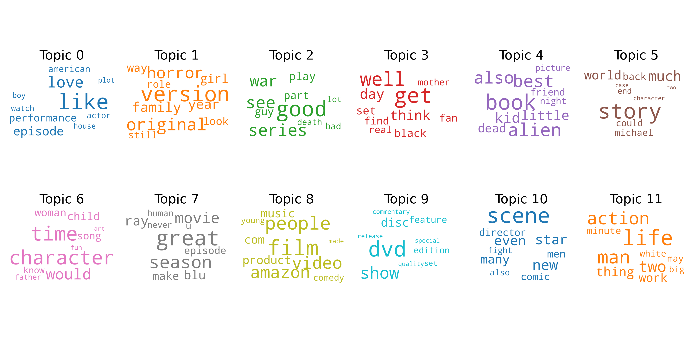

# Movie Reviews Topic Modeling with Spark
Topic Modeling pipeline using Spark NLP for preprocessing and Spark MLlib’s LDA to extract topics from the data.

## Project Intro/Objective
Generate topic words associated with a textual review. Latent dirichlet allocation (LDA) model is used to cluster topics from textual reviews.

### Methods Used
* Machine Learning
* Topic Modeling
* Data Visualization

### Technologies
* Python
* Pandas, jupyter
* Spark

## Project Description
Data from [Amazon movie reviews](https://snap.stanford.edu/data/web-Movies.html)

1. `topic_modeling.ipynb` Overview of LDA topic modeling and visualization.
2. `topic_modeling.py` Implementation of Spark data preprocessing and modeling.

## Process Flow
- data exploration
- data processing
- topic modeling
- data visualization
- reporting

## Featured Notebooks
* [Notebook](topic_modeling.ipynb)